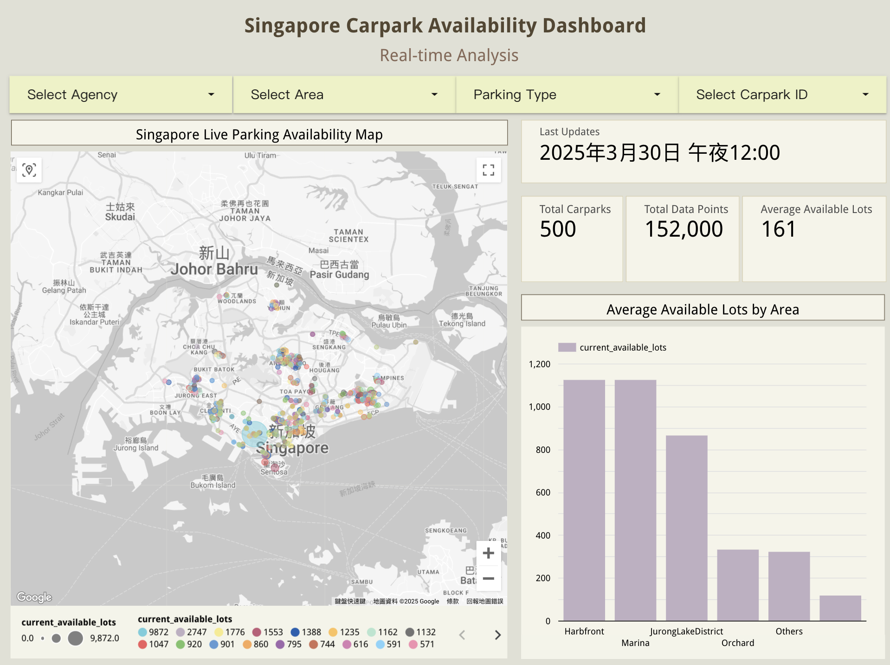
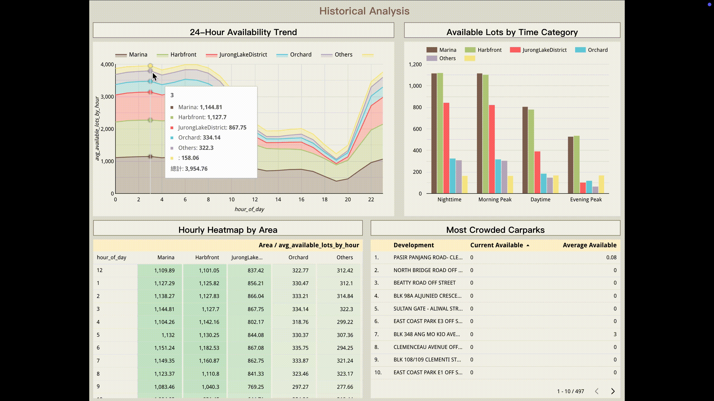

# Singapore Carpark Availability Data Engineering Project


## Problem Statement

With the acceleration of urbanization and the increase in private car ownership, parking resources in Singapore are becoming increasingly strained. As a highly urbanized country, Singapore has limited land resources, making parking spaces a scarce and sought-after infrastructure component. According to data from the Land Transport Authority of Singapore, parking occupancy rates in commercial and residential areas often reach over 95% during peak hours, making "parking difficulties" a common frustration for urban residents.

After my family recently purchasing a new car, we have experienced this social phenomenon firsthand. We've frequently encountered situations where we couldn't find parking spaces at shopping malls, restaurants, or HDB residential parking lots. Sometimes we had to circle for tens of minutes or been forced to use alternative parking lots far from our destination. This not only wastes time, increases fuel consumption and carbon emissions, but also leads to cascading problems such as being late for appointments or missing activities, significantly affecting quality of life and urban operational efficiency.

This widespread social problem motivated me to develop a data engineering project focused on monitoring available parking spaces in Singapore. By collecting and analyzing real-time data on parking availability, I aim to build an intelligent system that helps drivers anticipate parking conditions at their destinations, make optimal travel plans, alleviate individual parking anxiety, improve overall urban traffic efficiency, and provide data support for future smart city parking management strategies.

## Overview

This project is a complete end-to-end data engineering pipeline that extracts, processes, and analyzes real-time parking lot data from the Land Transport Authority (LTA) of Singapore's open Carpark Availability API. By implementing a stream processing architecture (Apache Kafka), the system can collect real-time information on available parking spaces across Singapore and efficiently store this data in a data lake (Google Cloud Storage) before transferring it to a data warehouse (BigQuery) for further processing.

Using dbt (data build tool) for data transformation and modeling ensures data quality and consistency. Ultimately, this carefully processed data is transformed into an interactive visualization dashboard using Google Looker Studio, allowing users to query and analyze parking availability in real-time to support travel decisions.

The project uses Apache Airflow for workflow orchestration, implementing a fully automated ELT (Extract, Load, Transform) process to ensure seamless integration of data throughout its lifecycle from collection to analysis.

The final output of this project is a comprehensive interactive dashboard that enables users to:

- View real-time available parking spaces across Singapore
- Analyze parking usage trends across different time periods and areas
- Predict parking difficulty at specific times and locations based on historical data
- Optimize trip planning and reduce time spent searching for parking spaces

Through this project, I hope to not only solve personal frustrations with driving, but also provide a valuable reference tool for other drivers, while demonstrating the application of modern data engineering techniques in solving real-life problems.

## Table of Contents

- [Tech Stack](#tech-stack)
- [Project Architecture](#project-architecture)
- [Project Structure](#project-structure)
- [Data Source Overview](#data-source-overview)
- [Data Pipeline](#data-pipeline)
- [Data Quality & Testing](#data-quality--testing)
- [Insights & Visualizations](#insights--visualizations)
- [Steps to Reproduce](#steps-to-reproduce)
- [Contact Information](#contact-information)

## Tech Stack
           

- **Containerization Platform:** Docker  
Docker provides standardized container environments, ensuring consistent project execution across different infrastructure. By encapsulating components (like Kafka, Airflow, etc.) into independent containers, it greatly simplifies deployment and achieves perfect consistency between development and production environments, reducing the complexity of environment configuration.

- **Cloud Platform:** Google Cloud Platform (GCP)  
GCP, as a global leading cloud service provider, offers complete infrastructure and service support. This project leverages GCP's high reliability, globally distributed architecture, and powerful data processing capabilities to build a scalable and cost-effective cloud-native solution, particularly suitable for developing and running data-intensive applications.

- **Infrastructure as Code:** Terraform  
Terraform enables programmatic management of infrastructure through declarative configuration files that automate the creation and management of GCP resources, including storage buckets, BigQuery datasets, and compute instances. This ensures repeatable infrastructure deployment, version control, and consistency, greatly improving development efficiency and system stability.

- **Workflow Orchestration:** Apache Airflow  
Airflow serves as a powerful workflow orchestration tool responsible for scheduling and monitoring the entire data pipeline. Through Python-defined DAGs (Directed Acyclic Graphs), it automates the execution of data extraction, processing, and loading tasks, and provides a rich monitoring interface and failure retry mechanisms, ensuring data processing reliability and visualization.

- **Data Processing:** Apache Kafka (with Dataflow)  
Kafka provides a high-throughput, low-latency distributed messaging queue system, enabling real-time data stream processing. Combined with Google Cloud Dataflow, it builds a powerful stream processing pipeline capable of handling high-frequency data updates from the LTA API, ensuring data timeliness and integrity, providing a reliable data source for subsequent analysis.

- **Data Transformation:** dbt Cloud  
dbt (data build tool) Cloud offers powerful data transformation and modeling capabilities, implementing structured transformations in the data warehouse through SQL and Git version control. dbt's modular design and testing framework ensure data quality and consistency, allowing data analysts to focus on business logic rather than technical implementation.

- **Storage & Warehousing:** Google Cloud Storage (GCS), BigQuery  
GCS serves as a high-performance object storage service, providing data lake functionality for storing raw and processed data. BigQuery, as a serverless data warehouse, offers millisecond-level query performance and PB-level data processing capabilities, achieving cost-effective large-scale data analysis, with its no-provisioning feature allowing systems to scale automatically according to demand.

- **Visualization:** Looker Studio  
Looker Studio (formerly Google Data Studio) provides rich data visualization capabilities, directly connecting to BigQuery data sources to create interactive dashboards. Through a drag-and-drop interface and custom charts, it displays key metrics and trends in parking availability, allowing end users to easily understand and utilize data insights to make informed parking decisions.

## Project Architecture


(This architecture diagram was created using [Lucidchart](https://www.lucidchart.com/pages).)

The data flow starts from the LTA Carpark API and proceeds through the following steps:

1. **Data Extraction**: An API client orchestrated by Airflow regularly fetches the latest parking data from the LTA API.
2. **Data Streaming**: The collected data is pushed to Apache Kafka message queues, enabling data buffering and preparation for stream processing.
3. **Stream Processing**: Google Cloud Dataflow consumes data from Kafka, performing initial cleaning and transformation.
4. **Data Storage**: Processed data is stored in two forms - raw data in the Google Cloud Storage data lake and structured data loaded into the BigQuery data warehouse.
5. **Data Modeling**: dbt Cloud performs further data transformation and modeling in BigQuery, building analysis-oriented data models.
6. **Data Visualization**: Finally, Looker Studio connects to the data models in BigQuery to create interactive dashboards providing real-time visualization and analysis of parking availability.

The entire process is orchestrated by Airflow, ensuring seamless collaboration between components and reliable task execution. This architecture supports both real-time data processing and historical data analysis, providing users with comprehensive insights into parking availability.

## Project Structure

```
LTA_CarParkAvailability_DE_Project/
├── README.md
├── .gitignore
├── terraform/              # Terraform configuration
│   ├── main.tf
│   ├── variables.tf
│   └── outputs.tf
├── extraction/             # Data extraction
│   ├── api_client.py
│   ├── test_api.py
│   └── test_kafka.py
├── processing/             # Stream processing
│   ├── dataflow
│   │   ├── kafka_to_gcs_pipeline.py
│   │   └── requirements.txt 
│   ├── schema/
│   │   └── carpark_schema.json 
│   ├── sql/
│   │   └── create_tables.sql 
│   ├── src/
│   │   ├── job/
│   │   │   └── create_tables.sql  
│   ├── docker-compose.yml
│   └── requirements.txt
├── scripts/                # Dataflow test scripts
│   ├── gcs_to_bigquery.py
│   ├── requirements.txt
│   ├── run_gcs_to_bigquery.sh
│   └── start_dataflow_job.sh
├── dbt/                    # dbt model
│   ├── models/
│   │   ├── staging/
│   │   ├── marts/
│   │   └── aggregations/
│   └── dbt_project.yml
├── orchestration/          # Orchestration process
│   ├── dags/
│   │   └── lta_carpark_dag.py
│   ├── docker-compose.yml
│   ├── Dockerfile
│   └── requirements.txt
├── dashboard/              # Dashboard configuration
│   └── looker_studio_exports/
├── docker-compose.yml
└── Makefile
```

### 1. Cloud Infrastructure Configuration (Terraform)

**Terraform Configuration Files**

- `main.tf` - Defines main GCP resource configurations
  - Creates Google Cloud Storage data lake buckets
  - Configures BigQuery datasets and required permissions
  - Sets up Compute Engine instances for running Airflow and Kafka
  - Defines network and security configurations
- `variables.tf` - Stores project parameters and environment variables
  - Contains configurable parameters like project ID, region, bucket names
  - Allows infrastructure code reuse across different environments
- `outputs.tf` - Provides key information output after infrastructure deployment
  - Displays endpoints and connection information for created resources
  - Facilitates subsequent configuration and resource management

### 2. Data Extraction Components (Extraction)

**LTA API Client**

- `api_client.py` - Handles interactions with the LTA DataMall API
  - Implements API authentication and request processing
  - Regularly extracts parking availability data
  - Handles API rate limiting and error scenarios
  - Converts raw data to structured format

**Test Scripts**

- `test_api.py` - Validates API connection and data retrieval
  - Tests API key validity and request formats
  - Confirms data response format meets expectations
- `test_kafka.py` - Tests Kafka data producer functionality
  - Validates data can be correctly sent to Kafka topics
  - Tests message serialization and partitioning strategies

### 3. Stream Processing Components (Processing)

**Dataflow Pipeline**

- `kafka_to_gcs_pipeline.py` - Reads and processes data streams from Kafka
  - Implements logic for consuming data from Kafka
  - Executes stream processing transformation operations
  - Writes processed data to Google Cloud Storage
  - Handles late data and windowing operations

**Data Schema Definition**

- `carpark_schema.json` - Defines the structure of parking data
  - Contains field names, types, and descriptions
  - Supports data validation and BigQuery table creation

**SQL Definition**

- `create_tables.sql` - Defines BigQuery table structures
  - Establishes raw, staging, and processing tables
  - Sets up partitioning and clustering strategies
  - Defines necessary views and functions

### 4. Dataflow Test Scripts (Scripts)

**Data Loading Scripts**

- `gcs_to_bigquery.py` - Loads data from GCS to BigQuery
  - Handles batch data loading
  - Performs schema validation and transformation
  - Supports incremental loading and full refresh modes

**Execution Scripts**

- `run_gcs_to_bigquery.sh` - Automates the data loading process
  - Sets up environment variables and parameters
  - Provides command-line interface for running loading tasks
- `start_dataflow_job.sh` - Deploys and starts Dataflow jobs
  - Configures Dataflow execution environment
  - Passes job parameters and dependencies

### 5. Data Transformation Models (dbt)

**dbt Model Hierarchy**

- **Staging Models** - `models/staging/` - Initial data preparation
  - Cleans and standardizes data from raw tables
  - Handles data type conversion and naming conventions
  - Implements basic data quality checks
- **Mart Models** - `models/marts/` - Business entity modeling
  - Establishes dimension tables (such as parking lots, locations, time)
  - Creates fact tables (such as parking lot occupancy, historical trends)
  - Implements star schema to support analysis needs
- **Aggregation Models** - `models/aggregations/` - Pre-calculates analytical metrics
  - Aggregates parking data by time, location, and other dimensions
  - Generates time series and trend analysis
  - Optimizes query performance and user experience

**Project Configuration**

- `dbt_project.yml` - Defines dbt project structure and runtime parameters
  - Sets up model dependencies and execution order
  - Configures testing and documentation generation
  - Defines environment variables and connection configuration


### 6. Workflow Orchestration (Orchestration)

**Airflow DAGs**

- `lta_carpark_dag.py` - Defines the complete data processing pipeline
  - Schedules API data extraction tasks
  - Coordinates Kafka and Dataflow processing flows
  - Triggers dbt transformation tasks
  - Implements data quality monitoring and alerts
  - Handles failure retry and recovery mechanisms


**Docker Configuration**

- `docker-compose.yml` - Local Airflow development environment
  - Configures Airflow and its dependent components
  - Sets up networks and volume mounts
  - Supports local testing and development
- `Dockerfile` - Custom Airflow container image
  - Installs specific dependencies and plugins
  - Configures environment variables and connections


### 7. Dashboard Configuration (Dashboard)

**Looker Studio Exports**

- Contains pre-configured dashboard templates
  - Real-time parking availability view
  - Historical trend analysis panel
  - Area and type comparison views

These components collectively form a complete data engineering pipeline, enabling the full process flow from data extraction to final visualization for Singapore's parking availability data analysis.

## Data Source Overview

Singapore's [Land Transport Authority (LTA) DataMall](https://datamall.lta.gov.sg/content/datamall/en.html) is a comprehensive transportation data platform that provides developers and researchers with a rich set of transportation-related APIs. These APIs offer real-time traffic condition updates (such as public transit arrival times, traffic incidents, etc.) and historical data, providing accurate and timely insights for various applications.

This project primarily uses the [Carpark Availability API](https://datamall.lta.gov.sg/content/datamall/en/dynamic-data.html), which updates every minute and provides real-time available parking space data across Singapore, including HDB public housing, shopping malls, and public car parks.

To use these APIs, you can register for a free API key through the [official channel](https://datamall.lta.gov.sg/content/datamall/en/request-for-api.html). It's worth noting that according to LTA's official notice, all HTTP API endpoints will cease service on May 31, 2025, which increases the timeliness and value of this project.


For more details, please refer to the [API documentation](docs/LTA_DataMall_API_User_Guide.pdf).

## Data Pipeline

### Data Pipeline Overview

This project implements a complete end-to-end data pipeline processing real-time parking availability data in Singapore. The pipeline extracts data from the LTA API, processes it through Kafka, stores it in GCS and BigQuery, and finally uses dbt for data transformation and Looker Studio for visualization.


### 1. Data Extraction (Extraction)

#### API Data Extraction
- **Technical Implementation**: Python API client with Airflow orchestration
- **Data Source**: Land Transport Authority (LTA) Carpark Availability API
- **Execution Frequency**: Every 5 minutes
- **Implementation Logic**:
  - Airflow DAG schedules API request task (`fetch_and_send_to_kafka`)
  - Adds timestamp and processes coordinate information for each record
  - Sends data directly to Kafka message queue

### 2. Stream Processing (Stream Processing)

#### Kafka to GCS Processing
- **Technical Implementation**: Google Cloud Dataflow using predefined templates
- **Processing Logic**:
  - Uses Dataflow's `Kafka_to_Gcs_Flex` template to consume data from Kafka
  - Applies 15-minute window operation (`windowDuration: "15m"`)
  - Writes raw JSON data in batches to GCS
- **Execution Task**: `kafka_to_gcs_dataflow` Airflow task

#### Data Transformation and Loading to BigQuery
- **Technical Implementation**: Dataflow's `GCS_Text_to_BigQuery_Flex` template
- **Processing Steps**:
  - Prepares JavaScript transformation script (`prepare_transform_script` task)
  - Creates BigQuery schema definition file
  - Reads JSON data from GCS and loads it into BigQuery
- **Execution Task**: `start_gcs_to_bigquery` Airflow task

### 3. Data Storage (Storage)

#### Data Lake (GCS)
- **Technical Implementation**: Google Cloud Storage as data lake
- **Storage Structure**:
  - **Raw Data**: `gs://lta-carpark/carpark-data/` - Stores JSON format data consumed from Kafka
  - **Temporary Data**: `gs://lta-carpark/temp/` - Temporary files during processing
  - **Scripts Directory**: `gs://lta-carpark/scripts/` - Stores data transformation scripts
  - **Schema Directory**: `gs://lta-carpark/schemas/` - Stores data schema definitions


#### Data Warehouse (BigQuery)
- **Technical Implementation**: Google BigQuery as data warehouse
- **Dataset Structure**:
  - **Raw Data**: `carpark_raw.carpark_availability` - Raw data loaded directly from GCS
  - **dbt Dataset**: `dbt_yzheng` - Data transformed and processed through dbt


### 4. Data Transformation (Transformation)

#### dbt Model Structure
- **Technical Implementation**: dbt Cloud for data transformation and modeling
- **Model Hierarchy**:
  - **Staging Model**: `stg_carpark_availability` - Standardizes raw data
  - **Dimension Model**: `dim_carparks` - Parking dimension table
  - **Fact Model**: `fact_carpark_availability` - Parking availability fact table
  - **Report Models**:
    - `rpt_carpark_hourly_trends` - Hourly trend report
    - `rpt_carpark_time_category` - Time category report
    - `rpt_carpark_utilization` - Parking utilization report


### 5. Workflow Orchestration (Orchestration)

#### Airflow DAG Structure
- **Technical Implementation**: Apache Airflow for workflow orchestration
- **Execution Frequency**: Every 5 minutes
- **Main Tasks**:
  1. `fetch_and_send_to_kafka`: Extracts data from LTA API and sends to Kafka
  2. `kafka_to_gcs_dataflow`: Uses Dataflow to write Kafka data to GCS
  3. `prepare_transform_script`: Prepares JavaScript transformation script on GCS
  4. `start_gcs_to_bigquery`: Uses Dataflow to load GCS data to BigQuery
- **Task Dependencies**:
  ```
  fetch_and_send_to_kafka >> kafka_to_gcs_dataflow >> prepare_transform_script >> start_gcs_to_bigquery
  ```


### 6. Data Visualization (Visualization)

#### Looker Studio Dashboard
- **Technical Implementation**: Google Looker Studio for interactive dashboard creation
- **Data Connection**: Direct connection to `dbt_yzheng.rpt_carpark_utilization` table in BigQuery
- **Dashboard Pages**:
  - **Real-time Analysis**: Shows current parking availability status
    - Singapore Live Parking Availability Map (bubble size indicates available spaces)
    - Key metric cards (Last Updates, Total Carparks, Total Data Points, Average Available Lots)
    - Average Available Lots by Area bar chart
    - Four filters (Agency, Area, Parking Type, Carpark ID)
  - **Historical Analysis**: Shows historical trends and patterns
    - 24-Hour Availability Trend
    - Available Lots by Time Category
    - Hourly Heatmap by Area
    - Most Crowded Carparks

### Data Flow Summary

The complete data flow is as follows:

1. Airflow triggers data extraction task every 5 minutes, extracts latest parking data from LTA API and sends it to Kafka
2. Dataflow job consumes data from Kafka, writes JSON format data to GCS
3. Another Dataflow job transforms data from GCS and loads it into the raw table in BigQuery
4. dbt models extract data from the BigQuery raw table, transform it, and create dimension tables, fact tables, and report tables
5. Looker Studio dashboard connects to report tables in BigQuery, providing visualization of real-time and historical data analysis

This architecture integrates data extraction, processing, storage, and visualization into a complete pipeline, providing users with a comprehensive view of Singapore's parking availability.

## Data Quality & Testing

### Multi-level Testing Framework

#### 1. Unit Testing (Unit Testing)

Unit testing focuses on verifying the correctness of the smallest testable units in the system, covering the following aspects in this project:

- **API Client Testing**
  - `test_api.py` - Validates connection to LTA API and data retrieval functionality
  - Simulates API responses to test error handling logic
- **Kafka Connection Testing**
  - `test_kafka.py` - Ensures data can be correctly produced to Kafka topics
- **Dataflow Transformation Testing**
  - Writes unit tests for each transformation step in the data processing pipeline
  - Validates pipeline output using test datasets
  - Tests window functions and time processing logic

#### 2. Integration Testing (Integration Testing)

Integration testing examines the collaborative capability between system components:

- **End-to-end Data Flow Testing**
  - Tests the complete process flow from API extraction to data storage
  - Verifies integration between Kafka and Dataflow
  - Tests the process of loading data into BigQuery
- **Infrastructure Integration Testing**
  - Uses Terraform's `terraform validate` and `terraform plan` to check infrastructure configuration
  - Validates permissions and connectivity between GCP resources

#### 3. dbt Testing Framework

Utilizes dbt's built-in testing framework to ensure consistency and accuracy after data transformation:

- **Generic Tests**
  - `not_null` - Ensures key fields are not null
  - `unique` - Validates primary key uniqueness
  - `accepted_values` - Checks the validity of enumerated values
  - `relationships` - Verifies foreign key referential integrity
- **Custom Data Tests**
  - Parking capacity consistency tests
  - Time series data completeness checks
  - Cross-validation between related models

## Insights & Visualizations

## Overview

This dashboard provides comprehensive insights into carpark availability across Singapore, offering both real-time monitoring and historical trend analysis. The visualization allows urban planners, commuters, and facility managers to make data-driven decisions about parking infrastructure and daily parking choices.

Note: Due to the impending depletion of GCP account credits and account expiration, the Looker Studio dashboard may become unavailable at any time. Please refer to the video or images below for reference.

Dashboard Link: [HERE](https://lookerstudio.google.com/s/hb3F4vmn3b8)

Dashboard PDF: [HERE](dashboard.looker_studio_exports/Singapore_Carpark_Availability_Dashboard.pdf)

Here is dashboard demo video(please click it):

[](https://youtu.be/Io5W081CxM4)

## Page 1: Real-time Analysis

The Real-time Analysis page provides an immediate snapshot of Singapore's current parking situation. **Note: Due to limited remaining GCP credits, this data pipeline was only operational between March 28-30, 2025.**



### Key Features:

#### Singapore Live Parking Availability Map

An interactive map displaying carpark locations across Singapore with bubble markers where the size indicates availability levels. Larger bubbles represent higher numbers of available parking spaces, while smaller bubbles indicate limited parking availability.


#### Key Metrics

- **Last Updates**: March 30, 2025, 12:00 AM
- **Total Carparks**: 500
- **Total Data Points**: 152,000
- **Average Available Lots**: 161

#### Average Available Lots by Area

A bar chart showing the average number of available parking spaces broken down by area, allowing users to quickly identify areas with higher parking availability.


#### Interactive Filters

Four dropdown selectors enable users to customize their view:

- **Select Agency**: Filter carparks by managing agency
- **Select Area**: Focus on specific geographical areas in Singapore
- **Parking Type**: Filter by car, motorcycle, or heavy vehicle parking
- **Select Carpark ID**: Drill down to specific carpark facilities


## Page 2: Historical Analysis

The Historical Analysis page offers deeper insights into parking availability patterns over time, helping users understand trends and make informed predictions.


### Key Visualizations:

#### 24-Hour Availability Trend

This time-series chart tracks average parking availability across a typical 24-hour cycle, revealing peak and off-peak hours for parking demand.



#### Available Lots by Time Category

A comparative analysis breaking down parking availability by different time categories (Morning Peak, Daytime, Evening Peak, Nighttime), allowing users to identify optimal parking times.


#### Hourly Heatmap by Area

A comprehensive heatmap displaying parking availability patterns across different areas and hours of the day, highlighting when and where parking pressure is highest.


#### Most Crowded Carparks

This ranking identifies carparks with consistently low availability, helping users avoid potentially full facilities and assisting urban planners in identifying infrastructure improvement priorities.


(The GIFs were generated using [CloudConvert](https://cloudconvert.com/mov-to-gif).)

## Steps to Reproduce

### Prerequisites
- Google Cloud Platform account
- Terraform installed
- Google Cloud SDK installed
- Python 3.8+ installed
- Docker and Docker Compose installed
- Git installed
- LTA DataMall API key (must be requested from Singapore Land Transport Authority)
- dbt Cloud account

### 1. Project Preparation

#### Clone the Project Repository
```bash
git clone https://github.com/your-username/LTA_CarParkAvailability_DE_Project.git
cd LTA_CarParkAvailability_DE_Project
```

#### Set Up Environment Variables
Create a `.env` file in the root directory with the following contents:
```
AIRFLOW_UID=501
AIRFLOW_GID=20
LTA_API_KEY=your-lta-api-key
```

### 2. Google Cloud Platform (GCP) Setup

#### Create GCP Project
1. Go to [Google Cloud Console](https://console.cloud.google.com/)
2. Create a new project and note the project ID and project number
3. Enable billing (requires a credit card, but you can use free credits)

#### Create Service Account and Authorization
1. Go to IAM & Admin > Service Accounts
2. Create a new service account
3. Grant the service account the following permissions:
   - Viewer
   - Storage Admin
   - Storage Object Admin
   - BigQuery Admin
   - Dataflow Admin
   - Compute Admin
4. Create and download the JSON format key file
5. Save the key file to a secure location

#### Set Up Local Authentication
```bash
# Set environment variable pointing to your service account key
export GOOGLE_APPLICATION_CREDENTIALS="path/to/your/service-account-key.json"

# Refresh token and verify identity
gcloud auth application-default login
```

#### Enable Required APIs
Enable the following APIs in the GCP console:
- Compute Engine API
- BigQuery API
- Dataflow API
- Cloud Storage API
- Identity and Access Management (IAM) API
- IAM Service Account Credentials API

### 3. Create GCP Infrastructure with Terraform

#### Modify Terraform Configuration Files
1. Navigate to the terraform directory:
```bash
cd terraform
```

2. Edit the `variables.tf` file to update the project ID:
```
variable "project" {
  description = "Your GCP project ID"
  default     = "your-project-id"
}
```

#### Initialize and Apply Terraform Configuration
```bash
# Initialize Terraform
terraform init

# View the resource plan to be created
terraform plan

# Create resources (enter yes to confirm)
terraform apply
```

After completion, you should see the following resources in the GCP console:
- GCS bucket `lta-caravailability`
- BigQuery datasets `dbt_yzheng` and `carpark_raw`

### 4. Set Up Kafka Stream Processing Environment

#### Start Kafka and Zookeeper
1. Navigate to the processing directory:
```bash
cd ../processing
```

2. Start Kafka and Zookeeper containers:
```bash
docker-compose up -d
```

This will start Kafka and Zookeeper containers, preparing for data stream processing.

### 5. Set Up Airflow Workflow Orchestration

#### Configure Airflow Environment
1. Navigate to the orchestration directory:
```bash
cd ../orchestration
```

2. Ensure the `.env` file is correctly configured (should be the same or similar to the root directory's `.env` file)

3. Start Airflow containers:
```bash
docker-compose up -d
```

4. Access the Airflow interface:
   - Open your browser and navigate to http://localhost:8085
   - Log in using the default username and password (airflow/airflow)

#### Configure Airflow Connections
In the Airflow web interface:
1. Go to Admin > Connections
2. Add Google Cloud connection:
   - Conn Id: `google_cloud_default`
   - Conn Type: `Google Cloud`
   - Upload service account key file

3. Add Kafka connection:
   - Conn Id: `kafka_default`
   - Conn Type: `Kafka`
   - Host: `kafka`
   - Port: `9092`

#### Enable Airflow DAG
1. After starting the Airflow containers, the DAG file will be automatically loaded from the project's `orchestration/dags` directory
2. Find the `lta_carpark_pipeline` DAG in the Airflow interface
3. Enable this DAG and verify its running status

### 6. Set Up dbt Cloud for Data Transformation

#### Register and Configure dbt Cloud
1. If you don't have a dbt Cloud account, go to [dbt Cloud](https://cloud.getdbt.com/) to register
2. After logging in, create a new project:
   - Click "Start a New Project"
   - Project name: `lta-carpark-availability`

#### Connect to BigQuery
1. During project creation, select BigQuery as your data warehouse
2. When setting up the BigQuery connection:
   - Upload the previously downloaded GCP service account JSON key file
   - Test the connection to ensure successful connectivity

#### Set Up dbt Development Environment
1. Set up the development environment:
   - Development environment name: `Development`
   - Development dataset: `dbt_dev_env` (dbt Cloud will create this automatically)

#### Connect dbt Repository
1. Configure GitHub connection in dbt Cloud:
   - Select "Link an Existing GitHub Repository"
   - Follow the prompts to authorize dbt Cloud access to your GitHub account
   - Select your project GitHub repository

2. Set up SSH deploy key:
   - dbt Cloud will provide an SSH deploy key
   - Add this key to your GitHub repository settings (Settings > Deploy keys > Add deploy key)
   - Make sure to check the "Allow write access" option

3. After successful connection, dbt Cloud will automatically clone the dbt models from the repository, with no need to manually create model files

### 7. Run dbt Models

#### Initialize and Run Models
1. In the dbt Cloud IDE, go to the "Develop" page
2. Check the project structure, confirming the following models exist:
   - `models/staging/stg_carpark_availability.sql`
   - `models/marts/dim_carparks.sql`
   - `models/marts/fact_carpark_availability.sql`
   - `models/reporting/rpt_carpark_hourly_trends.sql`
   - `models/reporting/rpt_carpark_time_category.sql`
   - `models/reporting/rpt_carpark_utilization.sql`

3. Run the models:
   - Click the "Run" button at the top of the IDE
   - Select "Start a run"
   - Wait for all models to build successfully

#### Configure Production Environment and Schedule
1. Set up production environment:
   - Go to "Environments" > "New Environment"
   - Environment name: `Production`
   - Environment type: `Deployment`
   - Connection: `BigQuery`
   - Dataset: `dbt_yzheng`
   - Test connection and save

2. Create scheduled job:
   - Go to "Jobs" > "Create Job"
   - Job name: `dbt_daily_build`
   - Environment: `Production`
   - Commands:
     ```
     dbt run
     dbt test
     ```
   - Set appropriate schedule frequency
   - Save and run the job to test

### 8. Create Looker Studio Dashboard

#### Connect Data Source
1. Go to [Looker Studio](https://lookerstudio.google.com/)
2. Click "Create" > "Report"
3. Select "BigQuery" as the data source
4. In the connection selection interface:
   - Select your GCP project
   - Select dataset `dbt_yzheng`
   - Select table `rpt_carpark_utilization`
5. Click "Connect"

#### Design Dashboard - Page 1 "Real-time Analysis"
1. Add title and description:
   - Add title: "Singapore Carpark Availability Dashboard"
   - Add descriptive text mentioning the data pipeline operational period (3.28-3.30)
2. Create map visualization:
   - Select "Add a chart" > "Map"
   - Configure the map to use Latitude and Longitude fields
   - Set bubble size based on available parking spaces
3. Add metric cards:
   - Create "Last Updates" card: March 30, 2025, 12:00 AM
   - Create "Total Carparks" card: 500
   - Create "Total Data Points" card: 152,000
   - Create "Average Available Lots" card: 161
4. Create "Average Available Lots by Area" bar chart:
   - Add bar chart, using Area as dimension
   - Use average available parking spaces as metric
5. Add filters:
   - Create "Select Agency" dropdown menu
   - Create "Select Area" dropdown menu
   - Create "Parking Type" dropdown menu
   - Create "Select Carpark ID" dropdown menu

#### Design Dashboard - Page 2 "Historical Analysis"
1. Add new page, name it "Historical Analysis"
2. Create "24-Hour Availability Trend" time series chart:
   - Add time series chart
   - Use hour as X-axis
   - Use average available parking spaces as Y-axis
3. Create "Available Lots by Time Category" grouped bar chart:
   - Add bar chart
   - Use time category as dimension
   - Use average available parking spaces as metric
4. Create "Hourly Heatmap by Area" heatmap:
   - Add table
   - Use area as rows
   - Use hour as columns
   - Use average available parking spaces as metric
   - Apply conditional formatting
5. Create "Most Crowded Carparks" ranking table:
   - Add table
   - Use carpark name as dimension
   - Use average available parking spaces as sorting metric
   - Sort in ascending order (fewest available spaces first)

#### Beautify and Optimize Dashboard
1. Adjust size and position of all charts to ensure an attractive layout
2. Add appropriate titles and descriptions for each chart
3. Add page navigation to make the dashboard easy to use
4. Set appropriate data formats (number formats, percentages, etc.)
5. Adjust colors and fonts to improve readability
6. Save and share the dashboard

### 9. Validate the Entire Data Pipeline
1. Check Airflow DAG status to confirm data extraction tasks are running properly
2. Confirm data is correctly stored in GCS
3. Confirm raw table data is loaded in BigQuery
4. Confirm dbt models correctly transform data and create final report tables
5. Confirm data visualization displays correctly in Looker Studio dashboard

## Contact Information

📧 Email: maddiezhengorz@gmail.com

For any queries, feel free to reach out!